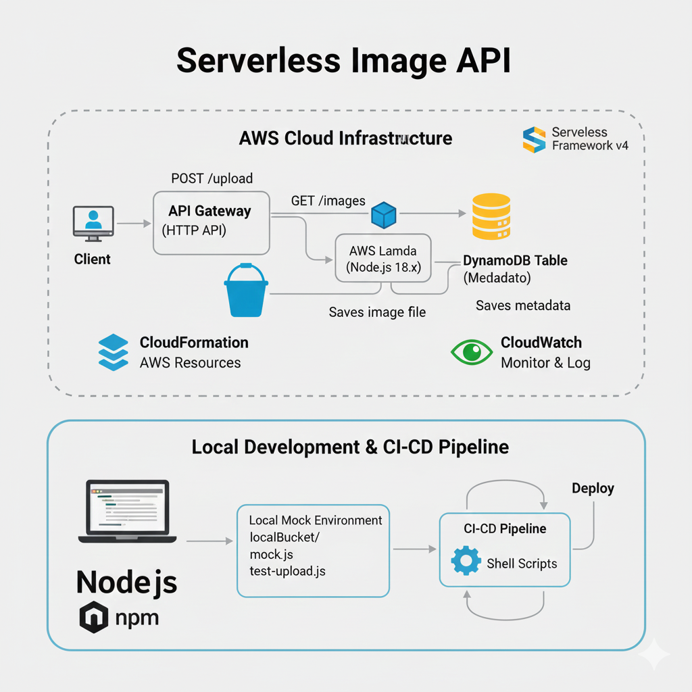

# 📸 Serverless Image API

A **Serverless image upload and retrieval API built with Node.js** and **AWS services (S3 + DynamoDB) with support for Local CI/CD testing**.

---

## 📚 Table of Contents

1. [Tech Stack](#tech-stack)
2. [Project Structure](#project-structure)
3. [Setup & Installation](#setup--installation)
4. [Local Development](#local-development)
5. [Local CI/CD Deployment](#local-cicd-deployment)
6. [AWS Deployment](#aws-deployment)
7. [API Usage](#api-usage)
8. [Notes](#notes)

---

## **Tech Stack**

- **Language:** Node.js 18.x  
- **Framework:** Serverless Framework v4  
- **Cloud Provider:** AWS  

**AWS Services used:**
- **S3 Bucket** → Stores uploaded images  
- **DynamoDB** → Stores metadata (image IDs, timestamps)  
- **Lambda** → Executes your image upload and retrieval code  
- **API Gateway (HTTP API)** → Exposes REST endpoints for upload (`POST /upload`) and list (`GET /images`)  
- **CloudFormation** → Serverless Framework automatically provisions all AWS resources (S3, DynamoDB, Lambda, API Gateway)  
- **CloudWatch** → Logs all Lambda invocations, errors, and metrics for monitoring  

**Local Development & CI/CD:**
- Node.js, npm  
- Local mock environment (`localBucket/` + `mock.js`)  
- CI/CD with shell scripts + Serverless Framework  

**Other Tools:**
- `uuid` → Generates unique IDs for images  
- `curl` → Testing endpoints  

---

## Project Workflow



---
## 📂 Project Structure

* **serverless-image-api/**
    * local/ (Local mock environment)
        * localHandler.js
        * mock.js
        * localBucket/
        * test-upload.js
        * img.txt
        * spiderman.jpg
    * handler.js (Lambda handler)
    * convert.js
    * get-presigned-url.js
    * package.json
    * package-lock.json
    * serverless.yml
    * scripts/
    * payload.json
    * spiderman.jpg

---

## Setup & Installation
1.Clone the repository:
```bash

   git clone <your-repo-url>
   cd serverless-image-api
```
2.Install dependencies:
```bash
   npm install
```
3.Optional: Create .env if using environment variables locally:
```bash
   export AWS_REGION=us-east-1
   export BUCKET_NAME=<your-local-bucket-name>
   export TABLE_NAME=ImageTable

```
---
## Local Development:
1.Encode a test image as Base64:
```bash
cd local
base64 spiderman.jpg > img.txt
```
2.Test local upload:
```bash
node test-upload.js
```
Sample output:
```bash
Upload Response: {
  "statusCode": 200,
  "body": "{\"message\":\"Uploaded\",\"id\":\"<uuid>\",\"imageUrl\":\"localBucket/<uuid>.jpg\"}"
}
List Response: {
  "statusCode": 200,
  "body": "[{\"id\":\"<uuid>\",\"url\":\"localBucket/<uuid>.jpg\",\"createdAt\":\"...\"}]"
}
```
---
## Local CI/CD Deployment

1.Run the CI/CD script:
```bash
sh scripts/local-cicd.sh
```
2.The script performs:
* Dependency installation

* Local tests (test-upload.js)

* Packaging files into build/build.zip

3.Output:
* build/build.zip contains the project ready for AWS deployment

* Local mock environment simulates S3 & DynamoDB
---

## AWS Deployment
1.Configure AWS CLI:
```bash
aws configure
```
2.Deploy via Serverless Framework:
```bash
sls deploy
```
3.Sample AWS output:
```bash
endpoints:
  POST - https://<api-id>.execute-api.us-east-1.amazonaws.com/upload
  GET - https://<api-id>.execute-api.us-east-1.amazonaws.com/images
functions:
  upload: serverless-image-api-dev-upload
  list: serverless-image-api-dev-list
```
4.Upload an image:
```bash
curl -X POST "https://<api-id>.execute-api.us-east-1.amazonaws.com/upload" \
  -H "Content-Type: application/json" \
  --data-binary @payload.json
```
---

## API Usage

**Upload Image**

* Endpoint: POST /upload

* Body (JSON):
```bash
{
  "fileName": "image.jpg",
  "fileContent": "<BASE64_CONTENT>"
}
```
* Response:
```bash
{
  "message": "Uploaded",
  "id": "<uuid>",
  "imageUrl": "<S3-presigned-url>"
}
```
* List Images

* Endpoint: GET /images

* Response:
```bash
[
  {
    "id": "<uuid>",
    "url": "<S3-presigned-url>",
    "createdAt": "2025-11-27T19:00:30.982Z"
  }
]
```
---

## Project Output / Demo


 ---
 


---
## Notes

* .serverless/ folder is ignored in GitHub.

* All sensitive environment variables should be managed via AWS Lambda environment variables or .env files (local).

* Local CI/CD simulates AWS environment using localBucket/ and mock.js.

* AWS deployment uses real S3 bucket and DynamoDB table.


